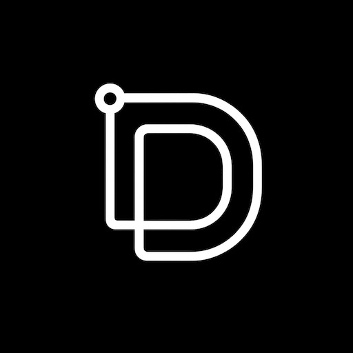

<p align="center">
  
</p>

<h1 align="center">Draht</h1>

<p align="center">
  <strong>Dynamic Routing for Agent & Task Handling</strong>
</p>

<p align="center">
  <a href="https://draht.dev">Website</a>
</p>

> [!WARNING]
> Draht is in early development. APIs, packages, and features may change without notice. Use at your own risk.

A modular, extensible AI coding agent framework. Extensions, skills, multi-model support — all in your terminal.

## Quick Start

```bash
# Install globally (requires bun: https://bun.sh)
bun add -g @draht/coding-agent

# Or run directly
bunx @draht/coding-agent

# Interactive mode with a prompt
draht "Refactor this module to use dependency injection"

# Non-interactive (process and exit)
draht -p "List all TODO comments in src/"
```

Or use the 1-command installer:

```bash
curl -fsSL https://draht.dev/install.sh | bash
```

## Packages

| Package | Description |
|---------|-------------|
| **[@draht/coding-agent](packages/coding-agent)** | Interactive coding agent CLI (`draht`) |
| **[@draht/ai](packages/ai)** | Unified multi-provider LLM API (OpenAI, Anthropic, Google, Bedrock, etc.) |
| **[@draht/agent-core](packages/agent)** | Agent runtime with tool calling and state management |
| **[@draht/tui](packages/tui)** | Terminal UI library with differential rendering |
| **[@draht/web-ui](packages/web-ui)** | Web components for AI chat interfaces |
| **[@draht/mom](packages/mom)** | Slack bot that delegates messages to the coding agent |
| **[@draht/pods](packages/pods)** | CLI for managing vLLM deployments on GPU pods |

## Architecture

```
draht (CLI)
├── @draht/coding-agent    ← main CLI, extension loader, session management
│   ├── @draht/agent-core  ← tool execution, message handling
│   │   └── @draht/ai      ← LLM providers (Anthropic, OpenAI, Google, Bedrock)
│   └── @draht/tui         ← terminal rendering
```

## Extensions

Draht supports a rich extension system. Extensions can register tools, commands, providers, themes, skills, and prompt templates.

```json
// package.json
{
  "draht": {
    "extensions": ["./my-extension.ts"]
  }
}
```

```typescript
// my-extension.ts
export default function(draht) {
  draht.registerCommand("hello", {
    handler: async () => console.log("Hello from my extension!")
  });
}
```

See [Extension Docs](packages/coding-agent/docs/extensions.md) for the full API.

## Development

```bash
bun install          # Install all dependencies
bun run build        # Build all packages
bun run check        # Lint, format, and type check (biome + tsgo)
```

## Environment Variables

| Variable | Description |
|----------|-------------|
| `DRAHT_OFFLINE` | Disable startup network operations (`1`/`true`/`yes`) |
| `DRAHT_CACHE_RETENTION` | Cache retention mode (`short`/`long`) |
| `DRAHT_PACKAGE_DIR` | Override package directory (for Nix/Guix store paths) |
| `DRAHT_SHARE_VIEWER_URL` | Base URL for /share command |
| `DRAHT_TIMING` | Enable performance timing (`1`) |

## Fork Attribution

This project is forked from [badlogic/pi-mono](https://github.com/badlogic/pi-mono) (Pi Agent by Mario Zechner). Licensed under MIT — see [LICENSE](LICENSE).
